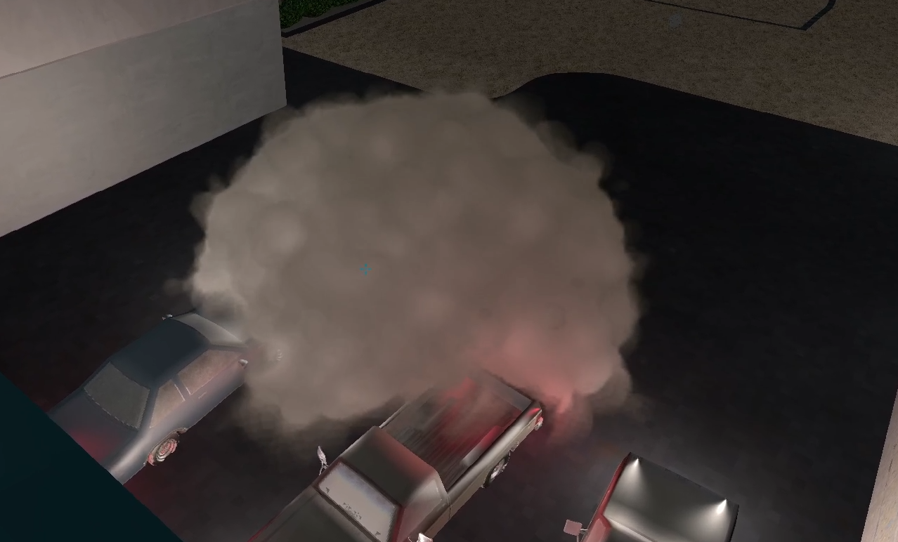

# 3D Voxel Smoke as a combination of Path tracing and deferred rendering

by Tobias Heller

## What was accomplished

**A Demo showcasing this project is available on [YouTube](https://youtu.be/jtDu43l0Yo0) <--**

### On the outside

The player can move freely inside a 3D environment. With a left mouse click, a raycast determines the destination of a smoke grenade which pours smoke into the environment on impact. The smoke interacts with 3D objects and is illuminated by nearby light sources. The smoke will find a way to expand until a minimum amount of voxels is filled with smoke, giving a somewhat realistic fluid behaviour. The smoke is not affected by gravity or wind, although a tiled worley noise texture gives the appearance of internal movement. All of this happens at 60 - 120 FPS. Moving closer to the smoke can lower the framerate to ~30 FPS.

### Under the Hood

#### Voxelization

A 3D Evironment created in blender is exported to a .txt file containing all relevant scene information (Smoke Sim/res/Scene.txt). This 3D Environment is then voxelized to a 120 x 120 x 20 grid using a series of Seperating Axis tests. This Voxelization is costly and can take several minutes. The resulting Voxelization is stored in a .vxl file. By default, the program will load this file instead of voxelizing the scene. To voxelize a modified scene, change `BOOL_LOAD_FROM_VXL` inside [voxel.hpp](Smoke Sim/src/voxel.hpp) to `false`. For debugging purposes, following a fresh voxelizetion, the voxelization is furtermore stored as an .obj. to change this, set `BOOL_OUTPUT_OBJ` to `false`.

#### Deferred Rendering the Objects

All models in the scene are saved as 3D models inside Smoke Sim/res/Meshes. During runtime, these models are loaded as .obj files and piped into the graphics card. To reduce unnecessary lighting calculations, a deferred rendering approach projects all relevant information on planes and calculates lighting in a second pass only for visible fragments.

#### Flood Filling the Scene

An algorithm closely related to floodfill pours smoke into the scene. Every Voxel stores its distance (in discrete steps) from the smoke origin. Until at least 1800 Voxels are filled with smoke, the allowed maximum of steps is increased at every frame. If 1800 voxels are filled with smoke, the emitter turns dormant. 

#### Worley Noise genration

For more convincing visuals, a compute shader generates a tiling worley noise texture once during startup.

#### Shooting Through the Smoke

The player can poke temporary holes through the smoke by left-mouse-clicking while aiming at the smoke. Every shot is saved as an origin point and a direction and piped into the path tracing shader. The CPU updates timers for every shot and lets them decay.

#### Path Tracing the Smoke

In a compute Shader, the smoke is path traced. Rays that don't intersect the smoke's bounding box are discarded to save resources. If a sample hits the smoke, the worley noise and the sample's position as well as the intersection with a bullet's path determine the amount of absorption at that point. Distances to all nearby light sources and a quadratic attenuation formula determine the illumination at that point. Then the path trace continues. As soon as absorption reaches 1 or the ray exceeds the allowed maximum length, we are finished with that ray.

#### Combining the output

Using the two render results from the path trace and the deferred rendering, we combine them inside a fragment shader by simply blending them over the path trace's absorption.

## Shortcomings, Future Goals

The smoke's illumination is not determined by path tracing over and over again towards the light from every sample in the path trace like suggested in the reference Video by Acerola. This results in less realistig lighting of the smoke, but is less expensive and allows the illumination through multiple light sources instead of just one. Furthermore, one worley noise texture is not enough to achieve high quality smoke. In future iterations i would like to add more sorts of noise like curl noise and more worley variations to improve the smoke's look.

The voxelization of the 3D environment works well for scenes designed with the voxelization in mind. However, non-axis aligned planes and large round objects - although approximated well enough - will lead to unpleasant edges in the smoke cloud. This is due to the trilinear sample of the smoke cloud assuming the sample of a wall to be very far away from the smoke sample and therefore returning an absorption close to 0. This could be remidied by introducing a bias or by storing the distance to the smoke origin inversely, so that values of 0 are interpreted correctly as the edges of the smoke.

The Performance of the demo could be better, rushed development lead to shortcomings in this regard. In future iterations, I want to iron out bottlenecks and find the sources of my occasional frame drops.


## How to Run the Demo
I developed this entire Demo In Visual Studio 2022 17.8.1. To run it, compiling the source files inside "Smoke Sim" thorugh CMake should be sufficient. If there are issues with the filepaths, all paths to resources like meshes and textures are located in `paths.hpp` and can be edited if needed.

```
######                                                          ######\n";
##              CONTROLS                                            ##\n";
##                                                                  ##\n";
##    [WASD] .  .  .  .  .   Movement                               ##\n";
##    [Mouse] .  .  .  .  .  Look around                            ##\n";
##    [Mouse_Middle] (Hold)  Stop turning                           ##\n";
##    [Space] .  .  .  .  .  Fly Up                                 ##\n";
##    [Shift] .  .  .  .  .  Fly Down                               ##\n";
##    [Mouse_L] .  .  .  .   Throw Smoke (Only on geometry)         ##\n";
##    [Mouse_R] .  .  .  .   Shoot (Only Visible in Smoke cloud)    ##\n";
##    [G]  .  .  .  .  .  .  Toggle Flight                          ##\n";
##                                                                  ##\n";
######                                                          ######\n";
```

**To Be noted: A grenade can misfire** if the voxelization has a false positive in the place the grenade landed. The command line will tell you if this is the case. Try throwing it somewhere else.

## File Conventions

### The Scene.txt File

The Scene File Contains all information about 3D Objects in the scene as well as their materials and Light sources. I an object shoud be excluded from the voxelization, its name has to start with IGNORE_. **It is necessary for the Scene.txt file to contain a line specifying a 3D object called "Grenade". Otherwise, the program will not work.**

The Scene.blend blender project inside res/Meshes/ contains a python script for exporting all Geometry as well as a Scene.txt file from all visible Mesh data and light sources in the scene. (Inside Blender: Sripts->Run Script)

Example of a Scene.txt interpretation:

```
LIGHT_SOURCE -13.4 1.0 14.5	1.0 0.0 0.1	30.0
Truck	24.5 0.3 25.0	-0.000 -1.628 -0.000	0.84 0.84 0.84	Truck	0.0
IGNORE_Porch_Peg	18.5 1.1 20.5	-0.0 0.0 0.0	1.00000 1.00000 1.00000	Wood	0.8
Grenade	-5.99782 57.54275 -5.52492	-0.000 -0.000 0.000	0.11518 0.11518 0.11518	Grenade	0.5
```
In this Example:
- A Light Source located at (-13.4, 1.0, 14.5) has the RGB color (1, 0, 0.1) and a power of 30.
- A 3D object
    - called "Truck" --> requires the file "Truck.obj" inside res/Meshes/
    - is located at (24.5 0.3 25.0).
    - has the euler rotation (-0.000 -1.628 -0.000) in radians
    - has the scale (0.84 0.84 0.84)
    - has a material called "Truck" --> requires a texture called "Truck_diffuse.png" inside res/Textures/
    - has the roughness 0.0
- Another 3D Object
    - called "IGNORE_Porch_Peg" --> requires the file "IGNORE_Porch_Peg.obj" inside res/Meshes/
    - is excluded from the world's voxelization (Smoke will not collide with this object.)
    - is located at (18.5 1.1 20.5)
    - has the euler rotation (0.0 0.0 0.0) in radians
    - has the scale (1, 1, 1)
    - has a material called "Wood" --> requires the image "Wood_diffuse.png" inside res/Textures
    - has a roughness of 0.8
    
- And the mandatory Grenade object is specified. All parameters of this can be changed, except the mesh name.


### The .vxl File

The vxl file contains the baked voxelization of a scene. Because it takes long to compute the voxelization for a big scene, the program will load this file instead of revoxelizing the scene by default. If you want to revoxelize because you changed the scene's geometry, set `BOOL_LOAD_FROM_VXL` inside [voxel.hpp](Smoke Sim/src/voxel.hpp) to `false`. For debugging purposes, following a fresh voxelizetion, the voxelization is furtermore stored as an .obj under res/Meshes/Voxels.obj. to change this, set `BOOL_OUTPUT_OBJ` to `false`.

### Paths.hpp

All Paths used are stored in `paths.hpp`. Because the program uses relative paths, it is possible that this will cause trouble on some machines. To remedy this, change the paths in `paths.hpp` to point to re "res" folder and everything should work.

## Authors and acknowledgment
The code was written by Tobias Heller inside Estard's [TGA Framework](https://github.com/Estard/TGA). The project and its implementation was largely inspired by the video [I Tried Recreating Counter Strike 2's Smoke Grenades](https://www.youtube.com/watch?app=desktop&v=ryB8hT5TMSg) by Acerola on YouTube.